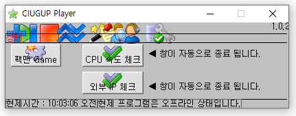
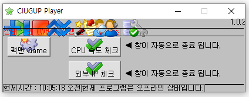
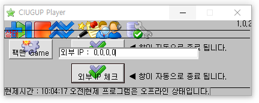
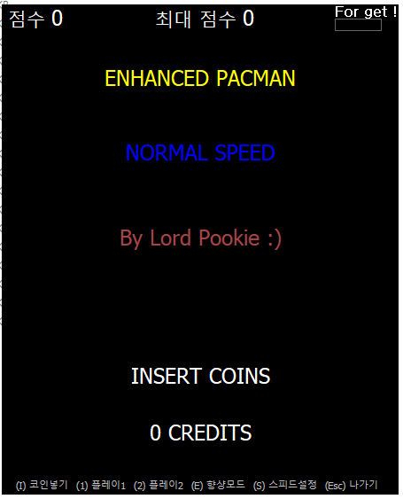

# CIUGUP-Player

## Download

- [Windows x64 zip file](./build/CIUGUP_Player_x86_0.0.1.zip?raw=true)

## Info

- 로컬에 있는 mp3 파일을 재생하거나 멈추거나 일시정지 할 수 있습니다.
  
- 부가 기능으로 CPU 속도 체크와 외부 IP, 팩맨 게임을 할 수 있습니다.
  - CPU 속도 체크
    
  - 외부 IP 체크
    
  - 팩맨 Game
    
    - Lord Pookie 님의 pacman vb 코드를 사용하여 한글로 바꾸기만 했습니다.

## System Requirements

- Windows XP 이상
- Windows Media Player 9 이상
- Visual BASIC 6 Runtimes Pack Release 7

## How to Install

- [여기서](https://www.microsoft.com/ko-kr/download/details.aspx?id=24417) 비주얼 베이직 6 런타임 팩을 다운로드 받아 설치합니다.
- 압축 파일을 다운로드 받아 해제 합니다.

## How to Update

- 자동 업데이트를 제공하고 있습니다. 
  - 프로그램 실행시 자동으로 확인합니다.
  - Updayt.exe 파일을 실행하면 작동합니다.
  - 프로그램 내에 업데이트 버튼을 누르면 진행합니다.
- 수동 업데이트는 [여기](https://blog.naver.com/cyydo96)에서 가능합니다.

## How to Delete

- 폴더를 제거합니다.

## What did you learn?

- 서버에서 값을 받아와 업데이트 하는 방법을 알 수 있었습니다.
- VB으로도 게임을 만들 수 있다는 것을 알 수 있었습니다.
- 웹에서 파싱해서 IP를 가져올 수 있다는 것을 알 수 있었습니다.

## Finally

- 서버가 터져서 무조건 업데이트 해야한다고 하는 버그가 있습니다.
- [Dconvert 프로젝트](https://github.com/Sotaneum/Dconvert)와 하나로 통합하여 VB.NET이나 C#으로 재구성해볼 생각입니다.
- pacman 게임은 [여기](http://www.planetsourcecode.com/vb/scripts/ShowCode.asp?txtCodeId=32821&lngWId=1)에서 최신 버전의 VB코드를 확인할 수 있습니다.
- 참고 한 도서
  - (2010)비주얼 베이직 6 - (주)사이버출판사

## Modify Content

- 2011.01.30 ( 0.0.1 )
  - 프로젝트 기능 구현 완료

## Copyright

- pacman 게임은 비상업적/상업적 용도로 사용 불가능합니다. 자세한 내용은 [여기](http://www.planetsourcecode.com/vb/scripts/ShowCode.asp?txtCodeId=32821&lngWId=1)에서 확인하세요.
- 그 외의 경우 비상업적 용도로 사용 가능하며 링크를 반드시 포함해주세요.
- 문제가 되는 내용이 있다면 언제든지 [`issue`](https://github.com/Sotaneum/CIUGUP-Player/issues/new), [`Pull requests`](https://github.com/Sotaneum/CIUGUP-Player/compare) 부탁드립니다.
